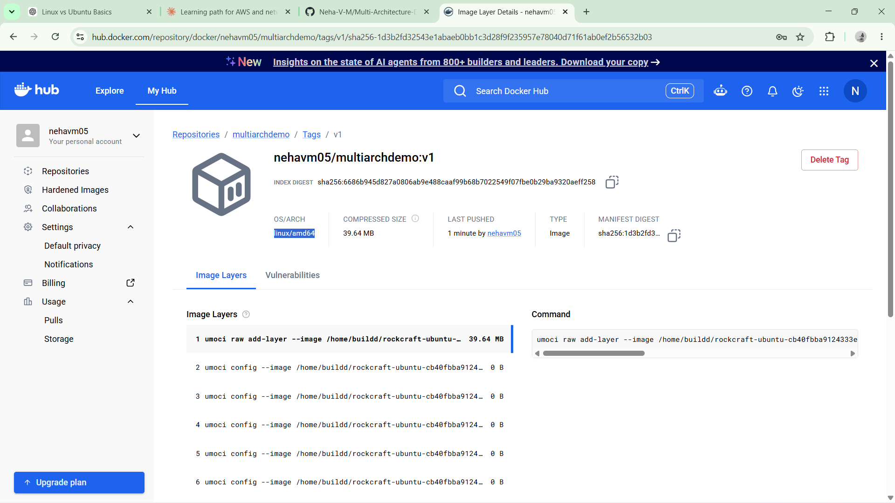

# Multi-Architecture Docker Image Build (AMD64 + ARM64)

A hands-on project demonstrating how to build, push, and validate multi-architecture Docker images using Docker Buildx/BuildKit — including reproducing and resolving a real cross-architecture compatibility failure across two different CPU architectures.

## Overview

A Docker image built on one CPU architecture does not automatically run on another. As of 2024, the "works on my machine" problem Docker mostly solved (by encoding the exact runtime environment as code) still has one gap: a container built on an ARM machine (e.g., Apple Silicon) can fail outright on an AMD/x86_64 machine, and vice versa — with modern environments spanning AMD, ARM, and other architectures side by side.

This project reproduces that failure firsthand, then resolves it using **Docker Buildx**, which builds a single image tagged for multiple target platforms at once — so the same `docker pull`/`docker run` command works correctly regardless of the pulling machine's architecture.

## Environment

| Machine | Architecture | Confirmed via |
|---|---|---|
| Personal laptop (Mac, Apple Silicon) | arm64 (ARM) | `uname -a` |
| AWS EC2 instance (Ubuntu) | x86_64 (AMD) | `uname -a` |

## What Was Done

### 1. Built and pushed a single-architecture image
A minimal Dockerfile was built and pushed from the ARM (Mac) machine using the standard `docker build` workflow:

```dockerfile
FROM ubuntu
CMD echo "I'm learning multi arch builds"
```

```bash
docker build -t multiarchdemo:v1 .
docker tag multiarchdemo:v1 <dockerhub-username>/multiarchdemo:v1
docker push <dockerhub-username>/multiarchdemo:v1
```

Docker Hub confirmed the `v1` tag existed with only **one** architecture layer underneath it — arm64, matching the machine it was built on.

### 2. Reproduced the cross-architecture failure
On the EC2 instance (AMD/x86_64), after installing Docker:

```bash
sudo apt update
sudo apt install docker.io -y
sudo usermod -aG docker ubuntu   # then log out and back in
docker run <dockerhub-username>/multiarchdemo:v1
```

The image pulled successfully, but failed to run with:

```
no matching manifest for linux/amd64
```

This confirmed the image only contained an arm64 layer — the AMD instance had no compatible layer to execute, demonstrating the real-world failure this project set out to solve.

### 3. Fixed it with Docker Buildx (multi-platform build)

**On a machine with Docker Desktop** (BuildKit is available out of the box):

```bash
docker builder ls
docker buildx build --platform linux/amd64,linux/arm64 \
  -t <dockerhub-username>/multiarchdemo:v2 --push .
```

**On a plain Linux/EC2 machine without Docker Desktop**, a builder had to be created manually:

```bash
sudo apt install docker-buildx

docker buildx create --name multiarch \
  --platform linux/amd64,linux/arm64 \
  --driver docker-container \
  --bootstrap --use

docker buildx build --platform linux/amd64,linux/arm64 \
  -t <dockerhub-username>/multiarchdemo:v3 --push .
```

| Flag | Meaning |
|---|---|
| `--name multiarch` | Names the new builder instance |
| `--platform linux/amd64,linux/arm64` | Declares which target platforms this builder supports |
| `--driver docker-container` | Runs BuildKit inside a Docker container (alternative: a Kubernetes pod) |
| `--bootstrap` | Initializes the new builder instance immediately |
| `--use` | Sets this builder as the default for subsequent builds |

### 4. Verified the fix
Back on the EC2 (AMD) instance, running the multi-arch image succeeded — the Docker engine automatically detected the machine's own architecture and pulled the matching layer, with no manual selection required:

```bash
docker run <dockerhub-username>/multiarchdemo:v3
# I'm learning multi arch builds
```

Docker Hub confirmed the `v2`/`v3` tags each listed **both** `amd64` and `arm64` underneath a single tag — unlike `v1`, which showed only one.

## Real Debugging Encountered

- **`permission denied` on first push (v1):** the image hadn't been tagged with the Docker Hub username/repo path yet — resolved with `docker tag` before pushing.
- **`access denied` on a fresh EC2 push:** no stored Docker Hub credentials on the new instance — resolved with `docker login` first.
- **`insufficient scope` authorization error:** same root cause as the very first push failure — forgot to tag the image with the correct username/repository path before pushing.
- **`docker images` showed nothing locally after a successful `buildx --push`:** this is expected, by design — `buildx` does not store multi-platform build output in Docker's local image store by default.

## Key Concepts

- **BuildKit** — Docker's modern, open-source builder, capable of producing multi-platform images from a single build command (unlike the legacy pre-BuildKit builder, which required a separate build per architecture).
- **Docker Buildx** — a CLI wrapper/extension around BuildKit, invoked via `docker buildx build`.
- **Single tag, multiple layers** — a multi-arch image is pushed under one tag but stored as multiple architecture-specific layers/manifests; the pulling machine's Docker engine selects the correct one automatically.
- **`docker build` vs. `docker buildx build`:**

| Aspect | `docker build` | `docker buildx build` |
|---|---|---|
| Underlying builder | Legacy builder or BuildKit, depending on setup | Always BuildKit |
| Multi-platform support | No | Yes, via `--platform` |
| Push as part of the build | Separate `docker push` step | Can push directly via `--push` |
| Stored in local `docker images`? | Yes | No, by default, for multi-platform builds |

## Why This Matters

Beyond this demo, multi-architecture builds solve a real scaling problem: for workloads with long build times (e.g., ML workloads, which can take 40–50 minutes per build), building separately for every target architecture (AMD, ARM, IBM Z/P, and more) can cost the better part of a day if done manually. A single multi-platform `buildx` build removes that entirely — one build, one push, every architecture covered.

It also solves a real open-source distribution problem: without a multi-arch image, a maintainer building only on AMD would ship something that fails outright for users on ARM machines (and vice versa) — with no separate instructions or image name needed once the image is properly multi-arch.

## Screenshots

| | |
|---|---|
| **Architecture confirmation** (`uname -a` on both machines) |  |
| **v1 — single-arch image on Docker Hub** (only one architecture listed) |  |
| **The failure** — `no matching manifest for linux/amd64` |  |
| **`docker builder ls`** before and after creating the `multiarch` builder |  |
| **Successful `buildx build --push`** |  |
| **Multi-arch image on Docker Hub** (both `amd64` and `arm64` listed) |  |
| **Successful run on EC2 (AMD)** with the multi-arch tag |  |

## Tech Stack

- Docker, Docker Buildx, BuildKit
- AWS EC2 (Ubuntu, x86_64)
- Docker Hub (image registry)

## What I'd Do Differently Next Time

- Run `docker login` proactively on any fresh machine before the first push, rather than discovering the missing credentials mid-push.
- Double-check image tagging (`username/repo:tag`) before every push — this was the root cause of two separate failures in this project.
- Test on genuinely separate physical/cloud architectures (as done here — Mac ARM + EC2 AMD) rather than assuming compatibility from documentation alone.
